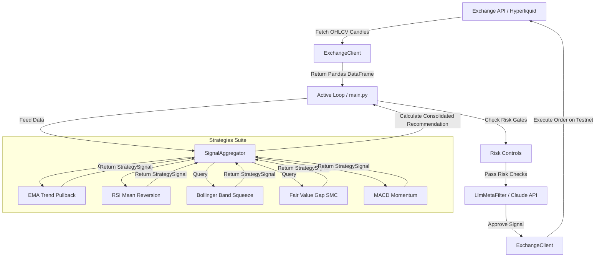

# Hyperbot: Technical System Architecture Document

This document outlines the software design, code flow, execution cycles, risk management controls, and LLM meta-filtering architecture for the **Hyperbot AI Trading Bot** built on the Hyperliquid exchange.

---

## 1. System Topology & Component Layout

Hyperbot is designed to be highly modular, separating data collection, mathematical strategy analysis, consensus aggregation, risk check gates, AI-driven auditing, and order execution.



---

## 2. Code Directory Overview

*   `backtest.py`: Walk-forward backtester simulating historical data bar-by-bar to ensure no lookahead bias.
*   `pnl_calc.py`: Risk-adjusted compounding equity calculator analyzing drawdowns and returns for sizing models.
*   `show_signals.py`: Generates the Per-Trade Confidence score matrix for backtest logs.
*   `analyze.py`: Read-only utility displaying real-time strategies evaluation in a clean terminal ASCII table.
*   `main.py`: Active execution scheduler enforcing safety gates, notifications, and LLM filtering.
*   `config.yaml`: Central registry containing all active asset definitions, timeframe intervals, and strategy parameters.
*   `hyperbot/`
    *   `__init__.py`: Package structure.
    *   `exchange_client.py`: Interfacing client wrapping Hyperliquid Info and Exchange APIs (defaults strictly to Testnet).
    *   `llm_filter.py`: Handles Claude 3.5 Sonnet meta-filtering trade reviews.
    *   `aggregator.py`: Handles voting tally math and consensus requirements.
    *   `strategies/`
        *   `base.py`: Defines `StrategySignal` data model and indicator math (EMA, ATR, RSI, Bollinger Bands).
        *   `ema_trend.py`: Bullish/Bearish trend pullbacks.
        *   `rsi_meanrev.py`: Extreme counter-trends near EMA50.
        *   `bb_squeeze.py`: Volatility band squeezes and breakouts.
        *   `fvg.py`: SMC imbalances with close-based fill validation.
        *   `macd_momentum.py`: MACD crossovers with histogram acceleration.
*   `tests/`
    *   `test_strategies.py`: Automated Python `unittest` strategy validation suite.

---

## 3. Consensus Aggregation Algorithm

The signal aggregator acts as the voting system. Instead of relying on a single indicator, it scores the market on a **0 to 100** scale across all 5 strategies. 

Let $S_i$ be the set of strategies where $i \in \{1, 2, 3, 4, 5\}$. Let $C_{buy}(S_i)$ and $C_{sell}(S_i)$ represent the buy and sell confidence scores of strategy $S_i$. Let $T_{agree}$ be the minimum confidence score required to "agree" (defined as `agree_threshold` in `config.yaml`, e.g., 50%).

1.  **Count Agreeing Strategies:**
    $$N_{buy} = \sum_{i=1}^{5} \mathbb{I}\left(C_{buy}(S_i) \ge T_{agree}\right)$$
    $$N_{sell} = \sum_{i=1}^{5} \mathbb{I}\left(C_{sell}(S_i) \ge T_{agree}\right)$$
2.  **Calculate Average Confidence Scores:**
    $$\mu_{buy} = \frac{1}{5} \sum_{i=1}^{5} C_{buy}(S_i)$$
    $$\mu_{sell} = \frac{1}{5} \sum_{i=1}^{5} C_{sell}(S_i)$$
3.  **Aggregation Recommendation Decision Rules:**
    *   **LONG Recommendation:**
        $$N_{buy} \ge N_{min} \quad \land \quad \mu_{buy} \ge 0.8 \cdot T_{agree} \quad \land \quad \mu_{buy} > \mu_{sell} + 15$$
    *   **SHORT Recommendation:**
        $$N_{sell} \ge N_{min} \quad \land \quad \mu_{sell} \ge 0.8 \cdot T_{agree} \quad \land \quad \mu_{sell} > \mu_{buy} + 15$$
    *   **STAND ASIDE:**
        If neither condition is met, the system stands aside (`stand_aside`).

---

## 4. Safety Risk Control Gates

To survive market variance and prevent devastating drawdowns, the `main.py` orchestrator applies five distinct risk check gates at every tick:

1.  ** circuit breaker Check:** Enforces a maximum daily loss cap (`max_daily_loss_pct` e.g., -5%). If the bot's PnL drops below this threshold today, trading locks until midnight UTC.
2.  **Volatility Filter:** Calculates relative volatility ($ATR_{14} / Price$). If volatility falls below the threshold (`min_atr_percent` e.g., 0.05%), it blocks entries, avoiding chopping fees in stagnant sideways markets.
3.  **Sizing Guard:** Sizing is hard-capped at a maximum fraction of the active balance (`max_position_sizing_pct` e.g., 20%) to avoid catastrophic losses on a single trade.
4.  **No Concurrency Gate:** The bot restricts execution to a maximum of **1 open position at a time**.
5.  **Global Halt Toggle:** Interrogates environment variables. If `HALT=1` is loaded in `.env`, the bot will completely skip order execution.

---

## 5. Claude LLM Meta-Filter Architecture

Rule-based strategies are deterministic and mathematically auditable, but cannot assess complex contextual alignment. Hyperbot uses Claude 3.5 Sonnet as a selective filter.

*   **Audit-Only Constraint:** The LLM cannot initiate trades. It can only audit mechanically triggered entries. It holds a **unilateral veto (REJECT)**.
*   **JSON Verdict Contract:** Claude is prompted with a strict system role requiring a formatted JSON object return:
    ```json
    {
      "approve": true,
      "confidence": "high",
      "reason": "Clear high timeframe EMA alignment supported by a fresh bullish FVG and accelerating MACD momentum. No Bollinger Band expansion conflicts detected."
    }
    ```
*   **Execution Rule:** Hyperbot only proceeds to submit order requests if `"approve": true` AND `"confidence": "high"` are returned. If the LLM returned `"confidence": "medium"` or `"low"`, the signal is rejected.
