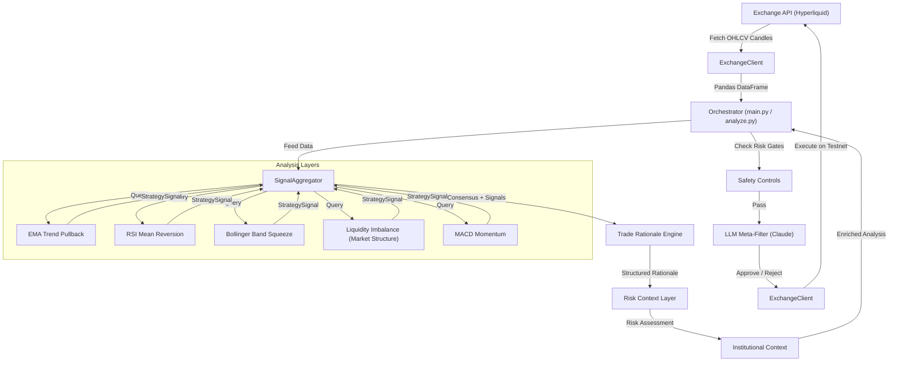
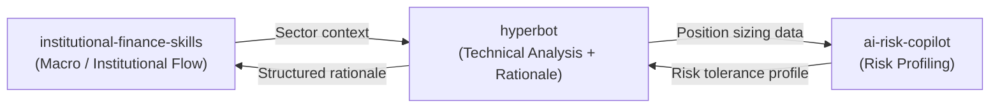

# System Architecture

This document covers the internal design, data flow, risk controls, and how the analysis layers compose into a single coherent output.

---

## System Topology

The framework has three stages: **observe** (gather data and run analysis), **reason** (structure a rationale and assess risk), and **gate** (apply LLM audit before any action).



---

## Ecosystem Integration

This repository is designed to work as part of a three-repo research platform. Each repo handles a different analysis layer:



The integration points are:
- **institutional_context.py** accepts sector flow data from `institutional-finance-skills`
- **risk_context.py** uses the same risk profile schema as `ai-risk-copilot`

When running standalone (no live feeds from the other repos), both modules operate in stub mode with structured placeholder data and clearly documented extension points.

---

## Module Responsibilities

| Module | File | Purpose |
|---|---|---|
| Strategy Layer | `hyperbot/strategies/*.py` | Independent technical analysis engines, each returning a 0-100 confidence score |
| Aggregator | `hyperbot/aggregator.py` | Consensus voting: counts agreements, computes averages, applies decision rules |
| Rationale Engine | `hyperbot/rationale_engine.py` | Composes all strategy outputs into a structured, explainable trade breakdown |
| Risk Context | `hyperbot/risk_context.py` | Applies configurable risk profiles to proposed positions |
| Institutional Context | `hyperbot/institutional_context.py` | Overlays macro-level institutional positioning data |
| Exchange Client | `hyperbot/exchange_client.py` | Hyperliquid API wrapper (testnet by default) |
| LLM Filter | `hyperbot/llm_filter.py` | Claude-based trade audit with unilateral veto |
| Backtester | `backtest.py` | Walk-forward historical simulation with no lookahead bias |
| PnL Calculator | `pnl_calc.py` | Compounding equity models and drawdown analysis |
| Analyzer | `analyze.py` | Live read-only analysis with full rationale output |
| Orchestrator | `main.py` | Active execution loop with all safety gates |

---

## Consensus Aggregation Algorithm

The aggregator scores the market on a 0-100 scale across all 5 analysis layers and applies three decision rules:

**1. Count agreeing strategies:**

For each direction, count how many strategies have a confidence score at or above the agreement threshold (default 50%):

```
N_buy  = count of strategies where buy_confidence >= threshold
N_sell = count of strategies where sell_confidence >= threshold
```

**2. Calculate average confidence:**

```
avg_buy  = mean of all 5 buy confidence scores
avg_sell = mean of all 5 sell confidence scores
```

**3. Decision rules:**

- **LONG**: `N_buy >= min_agree` AND `avg_buy >= 0.8 * threshold` AND `avg_buy > avg_sell + 15`
- **SHORT**: `N_sell >= min_agree` AND `avg_sell >= 0.8 * threshold` AND `avg_sell > avg_buy + 15`
- **STAND ASIDE**: Neither condition met

The 15-point differential requirement prevents trades where both directions show similar conviction. If the market is ambiguous, the system says so.

---

## Safety Controls

The orchestrator (`main.py`) applies five risk gates at every execution tick:

1. **Circuit Breaker** -- Maximum daily loss cap. If the session PnL drops below the configured threshold, trading locks until midnight UTC.
2. **Volatility Filter** -- Calculates ATR-relative volatility. Below-threshold volatility blocks entries to avoid choppy, fee-grinding markets.
3. **Sizing Guard** -- Hard cap on maximum position size as a fraction of active balance.
4. **No Concurrency** -- Maximum of one open position at a time.
5. **Global Halt** -- If `HALT=1` is set in the environment, execution is completely disabled.

---

## LLM Meta-Filter Design

The Claude integration follows a strict audit-only contract:

- The LLM **cannot create signals**. It can only review mechanically triggered entries.
- It returns a structured JSON verdict: `{approve, confidence, reason}`
- Execution only proceeds when `approve: true` AND `confidence: high`
- Any other response is a rejection. There is no override mechanism.

This design ensures the LLM acts as a filter, not a signal source. The mechanical system proposes; Claude disposes.

---

## Trade Rationale Engine Design

The `TradeRationaleEngine` class consumes all strategy signals and the aggregator's consensus, then structures them into a `TradeRationale` dataclass containing:

- Market state: trend direction, volatility regime, momentum state
- Key structural levels (FVG zones, dynamic EMA support/resistance)
- Entry, stop-loss, and take-profit levels (ATR-based)
- Position sizing via fixed fractional risk model
- Explicit invalidity conditions for setup invalidation
- Per-strategy breakdown showing individual agreements
- Summary narrative in plain language

The rationale is the primary output of the framework. It makes every assumption visible and every exit condition concrete.

---

## Risk Context Layer Design

The `RiskContextLayer` applies one of three configurable profiles (conservative, moderate, aggressive) to any proposed trade. It evaluates four constraints:

1. Position size cap per profile
2. Daily drawdown buffer remaining
3. Minimum risk/reward ratio
4. Minimum strategy agreement count (hard floor of 3/5 regardless of profile)

The output is a `RiskAssessment` with an adjusted position size, list of warnings, and a plain-language rationale explaining the decision.
