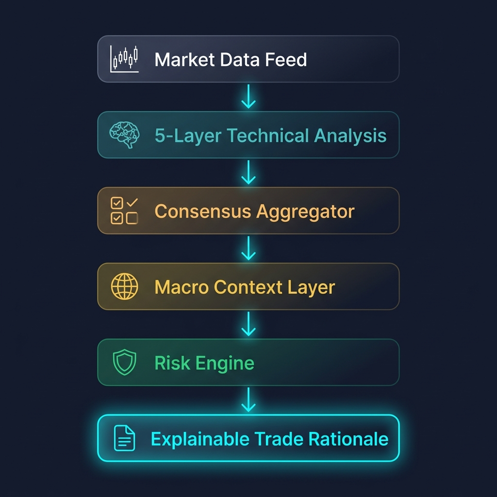
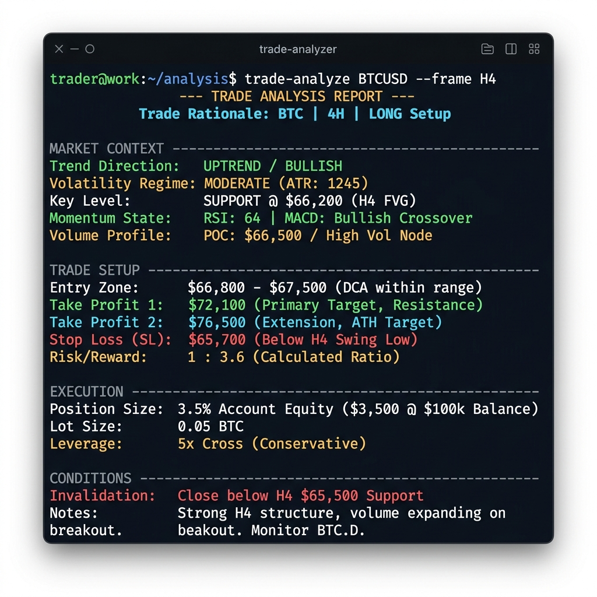
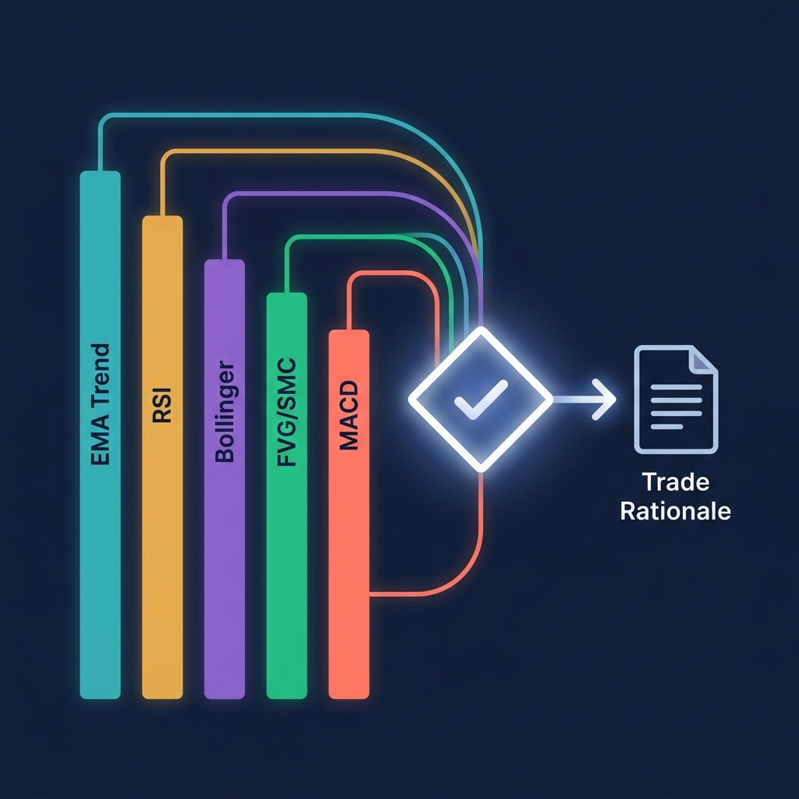

# Hyperbot - Explainable Trading Intelligence Framework

<p align="center">
  
</p>

<p align="center">
  <strong>This is not a trading bot. This is a framework that explains why a trade makes sense -- or why it doesn't.</strong>
</p>

---

## Why This Exists

This project explores a specific question: **what happens when you build a trading analysis system that prioritizes explainability over prediction?**

Most trading systems optimize for one thing -- generating signals. Buy or sell. Green arrow or red arrow. The human is expected to trust the output without understanding what produced it, what assumptions it rests on, or what conditions would break it.

That's a poor interface between a human and a decision-support system. Especially in markets, where understanding *why* matters as much as understanding *what*.

Hyperbot is built around a different design principle: every analysis should produce a structured rationale that makes its assumptions visible, its exit conditions concrete, and its confidence level honest. If the market is ambiguous, the system says so. If a setup is technically valid but violates your risk tolerance, it flags that explicitly. If there's nothing to do, it tells you to sit on your hands -- with the same rigor it uses for actionable setups.

This is a research and learning framework for exploring how explainable AI systems can assist human trading workflows through contextual reasoning, risk awareness, and multi-layer market interpretation.

---

## How the Pipeline Works

<p align="center">
  
</p>

Every analysis runs through a six-stage pipeline:

1. **Market Data Feed** -- Live OHLCV candles from the Hyperliquid exchange API
2. **5-Layer Technical Analysis** -- Five independent engines score the market from different angles (trend, momentum, volatility, structure, mean reversion)
3. **Consensus Aggregator** -- Counts agreements, computes weighted averages, applies decision rules
4. **Macro Context Layer** -- Overlays institutional positioning data from the broader ecosystem
5. **Risk Engine** -- Applies your risk tolerance profile to the proposed position
6. **Explainable Trade Rationale** -- Structures everything into a readable breakdown with explicit invalidity conditions

The output is not a signal. It's a document that explains what the market looks like, why the layers agree or disagree, and what would need to change for the analysis to become invalid.

---

## What Actually Happens When You Run It

When you ask Hyperbot to analyze a market, it produces a **Trade Rationale** -- a structured, multi-layer breakdown that reads like a research note, not a signal alert.

<p align="center">
  
</p>

Here's what that output contains:

| Layer | What It Tells You |
|---|---|
| **Trend Direction** | Is price above or below the 200-period moving average? Are the fast and slow EMAs aligned? |
| **Volatility Regime** | Is the market coiled tight (squeeze) or expanding? Where does current volatility sit relative to recent history? |
| **Key Structural Level** | Is there a Fair Value Gap, a dynamic support/resistance zone, or a fresh imbalance nearby? |
| **Momentum State** | Is MACD crossing? Is the histogram accelerating or stalling? |
| **Risk/Reward** | Exact stop-loss and take-profit levels based on ATR, with a calculated ratio. |
| **Position Sizing** | How much of your account this trade would risk, derived from the stop distance and your risk tolerance. |
| **Invalidity Conditions** | The specific things that would break the setup. Not vague warnings -- concrete price levels and indicator states. |

The point is not prediction. The point is **structured thinking about markets**, where every assumption is visible and every exit condition is defined in advance.

---

## The Five Analysis Layers

<p align="center">
  
</p>

Instead of relying on one indicator and hoping for the best, Hyperbot runs five independent analysis engines simultaneously. Each one looks at the market from a different angle:

**1. EMA Trend Pullback** -- Follows the macro trend using the 200-period moving average. Waits for price to pull back to the fast 20-period EMA before signaling. It's patient. It doesn't chase.

**2. RSI Mean Reversion** -- The contrarian. Watches for extreme oversold or overbought conditions near key moving averages. When everyone else is panicking, this one is paying attention.

**3. Bollinger Band Squeeze** -- Detects low-volatility compression. Markets coil before they move. This layer identifies when volatility is historically tight and watches for the expansion that follows.

**4. Fair Value Gap (SMC)** -- Uses Smart Money Concepts to find price imbalances -- gaps in the market structure where institutions left footprints. Validates fills with strict close-based confirmation, not wick noise.

**5. MACD Momentum** -- Catches the short-term waves. Tracks MACD crossovers and histogram acceleration to confirm that momentum is actually behind the move, not just price noise.

A trade setup only becomes actionable when **the majority of these layers agree** and the confidence score in the winning direction meaningfully exceeds the opposing side. The framework calls this the **Consensus Aggregator**, and it exists specifically to prevent low-conviction entries.

---

## The Risk-Awareness Layer

Generating a setup is only half the job. The other half is asking: **should you actually take this trade given your current risk state?**

Hyperbot includes a configurable risk profile system with three presets:

| Profile | Max Position | Max Daily Loss | Min R/R | Best For |
|---|---|---|---|---|
| **Conservative** | 5% | -2% | 1:2.5 | Paper trading and research |
| **Moderate** | 15% | -4% | 1:2.0 | Default analysis mode |
| **Aggressive** | 25% | -6% | 1:1.5 | Only after extensive validation |

The risk layer evaluates every proposed setup against these constraints. If you've already hit your daily loss limit, it blocks new entries. If the risk/reward ratio doesn't meet the minimum threshold, it flags the setup. If fewer than 3 out of 5 strategies agree, it rejects regardless of profile.

This isn't a suggestion system. It's a guardrail.

---

## The Claude LLM Meta-Filter

When a mechanical setup triggers -- meaning the numbers say "go" -- there's one more gate before anything happens.

The entire technical context (every strategy's score, the regime classification, the proposed entry/stop/target) gets sent to Claude for a structured risk audit. Claude doesn't generate signals. It can only do one thing: **veto**.

If it spots conflicting regimes, stale levels, or structural inconsistencies that the mechanical system missed, it rejects the trade. This is a unilateral block -- there's no override.

The output is a structured JSON verdict with an explicit reason:

```json
{
  "approve": true,
  "confidence": "high",
  "reason": "Clear high timeframe EMA alignment supported by a fresh bullish FVG and accelerating MACD momentum. No Bollinger Band expansion conflicts detected."
}
```

The bot only proceeds when both `approve: true` and `confidence: high` are returned. Anything less is a rejection.

---

## Example Outputs

The `examples/` directory contains complete, representative outputs showing what the framework actually produces. These aren't sanitized demos -- they show the full pipeline output including cases where the system says "do nothing" and cases where the risk layer rejects a technically valid setup.

| Example | Outcome | What It Demonstrates |
|---|---|---|
| [BTC Long Setup](examples/btc_long_setup.md) | Approved | Clean 4/5 agreement, full rationale with FVG structural anchor |
| [ETH No Setup](examples/eth_no_setup.md) | Stand Aside | 0/5 agreement, framework correctly identifying ambiguous market |
| [SOL Short -- Risk Rejected](examples/sol_short_risk_rejected.md) | Flagged | Technically valid 4/5 short rejected by conservative risk profile |

The ETH example is arguably the most important one. Any system can tell you to buy when indicators are screaming. The real test is whether it can tell you to sit on your hands when the market is ambiguous.

---

## Where This Fits

This repository is part of a larger ecosystem of finance-AI research tools. Each repo handles a different layer of the analysis stack:

<p align="center">
  
</p>

| Repository | Role |
|---|---|
| **institutional-finance-skills** | Macro-level institutional positioning, 13F analysis, sector flow intelligence |
| **ai-risk-copilot** | Portfolio risk assessment, drawdown analysis, risk tolerance profiling |
| **hyperbot (this repo)** | Technical market analysis, trade rationale generation, explainable setups |

The Institutional Context module in this repo is designed as a bridge -- it can accept sector flow signals from `institutional-finance-skills` and overlay them on technical setups. The Risk Context module mirrors the schema used by `ai-risk-copilot`, so both systems can share a consistent risk language.

These aren't just three repos on a GitHub profile. They're designed to compose into a coherent research platform for understanding how markets work across multiple layers.

---

## Using This as an AI Skill

This repository is structured to work as a native skill for AI coding assistants. When loaded into Claude Code, Gemini, or any assistant that supports skill definitions, it teaches the AI how to:

- Run live market analysis: `python3 analyze.py --symbol BTC --risk-profile conservative`
- Execute historical backtests: `python3 backtest.py --days 60`
- Evaluate position sizing models: `python3 pnl_calc.py`
- Run the full orchestrator loop: `python3 main.py`

The skill definition lives at `skills/ai-trading-skill/SKILL.md` and `SKILL.md` (root). No extra configuration needed -- just load the repo and start asking questions in natural language.

### As a Claude Code Skill
When you run `claude` inside this repo, it automatically reads the skill instructions from `.claude/skills/ai-trading-skill/SKILL.md`.

### As an AI Plugin
The `plugin.json` in the root defines this as a loadable plugin for any platform supporting custom plugin registries.

---

## Repository Map

```
hyperbot-ai-trading-claude-skill/
  hyperbot/
    strategies/
      base.py                # Indicator math and StrategySignal data model
      ema_trend.py           # Layer 1: EMA Trend Pullback
      rsi_meanrev.py         # Layer 2: RSI Mean Reversion
      bb_squeeze.py          # Layer 3: Bollinger Band Squeeze
      fvg.py                 # Layer 4: Fair Value Gap (SMC)
      macd_momentum.py       # Layer 5: MACD Momentum
    aggregator.py            # Consensus voting engine
    rationale_engine.py      # Trade Rationale Engine (explainability core)
    risk_context.py          # Risk-awareness layer with profile presets
    institutional_context.py # Institutional context bridge
    exchange_client.py       # Hyperliquid API client (testnet default)
    llm_filter.py            # Claude LLM meta-filter
  tests/
    test_strategies.py       # Automated test suite (25 tests)
  examples/
    btc_long_setup.md        # Full BTC long rationale (approved)
    eth_no_setup.md          # ETH stand-aside analysis (no trade)
    sol_short_risk_rejected.md # SOL short rejected by risk layer
  skills/
    ai-trading-skill/
      SKILL.md               # AI agent instruction manual
  docs/
    images/                  # Documentation images and diagrams
  analyze.py                 # Live market analysis with rationale output
  backtest.py                # Walk-forward historical backtester
  pnl_calc.py                # Compounding equity models calculator
  show_signals.py            # Trade signals matrix display
  main.py                    # Execution orchestrator with safety gates
  config.yaml                # All strategy parameters and settings
  plugin.json                # AI plugin definition
  ARCHITECTURE.md            # Technical system architecture
  SKILL.md                   # Root-level AI skill definition
```

---

## Quick Setup

### 1. Create your environment
```bash
python3 -m venv .venv
source .venv/bin/activate
pip install -r requirements.txt
```

### 2. Configure your keys
```bash
cp .env.example .env
```
Open `.env` and add your Hyperliquid wallet signing key and Anthropic API key. This file is git-ignored and will never be pushed.

### 3. Verify everything works
```bash
# Run the test suite
python3 -m unittest tests/test_strategies.py

# Analyze BTC with the conservative risk profile
python3 analyze.py --risk-profile conservative

# Run a 30-day backtest
python3 backtest.py --days 30
```

---

## License and Author

**Author:** Rignesh P

**License:** This project is licensed under the [AI Learning and Research License](LICENSE). It is provided for general usage, primarily intended for AI learning, education, and quantitative research purposes.

---

## Limitations and Disclaimers

This section exists because serious research tools are honest about their boundaries.

**What this framework is:**
- An educational and research tool for exploring explainable AI in trading workflows
- A system for structuring market analysis into transparent, auditable rationales
- A framework for learning multi-strategy consensus design, risk profiling, and LLM-assisted decision auditing

**What this framework is not:**
- Financial advice
- A guaranteed profit system
- A replacement for professional risk management
- A production-grade trading system for live capital without extensive personal validation

**Known limitations:**
- **AI uncertainty**: The LLM meta-filter (Claude) is a probabilistic system. Its audit quality depends on prompt design and the model's training distribution. It can miss edge cases.
- **Institutional data latency**: The institutional context module uses stub data in standalone mode. Live institutional flow data (13F filings, sector flows) is inherently delayed by weeks to months.
- **Indicator lag**: All technical indicators used (EMA, RSI, MACD, Bollinger Bands) are lagging by design. They describe what has happened, not what will happen.
- **Single exchange**: Currently designed for Hyperliquid only. Extending to other exchanges requires adapting the exchange client.
- **Backtesting limitations**: Walk-forward simulation does not account for slippage, partial fills, or liquidity depth. Real execution will differ from simulated results.

**Risk acknowledgment:**

Financial trading involves substantial risk of loss. This software is provided as an experimental research tool. Always run on Testnet before committing any capital. Always define your invalidation conditions before entering a trade. Always understand exactly how much you are risking on every position.

The goal of this project is not to make trading easy. It's to make trading thinking visible.
