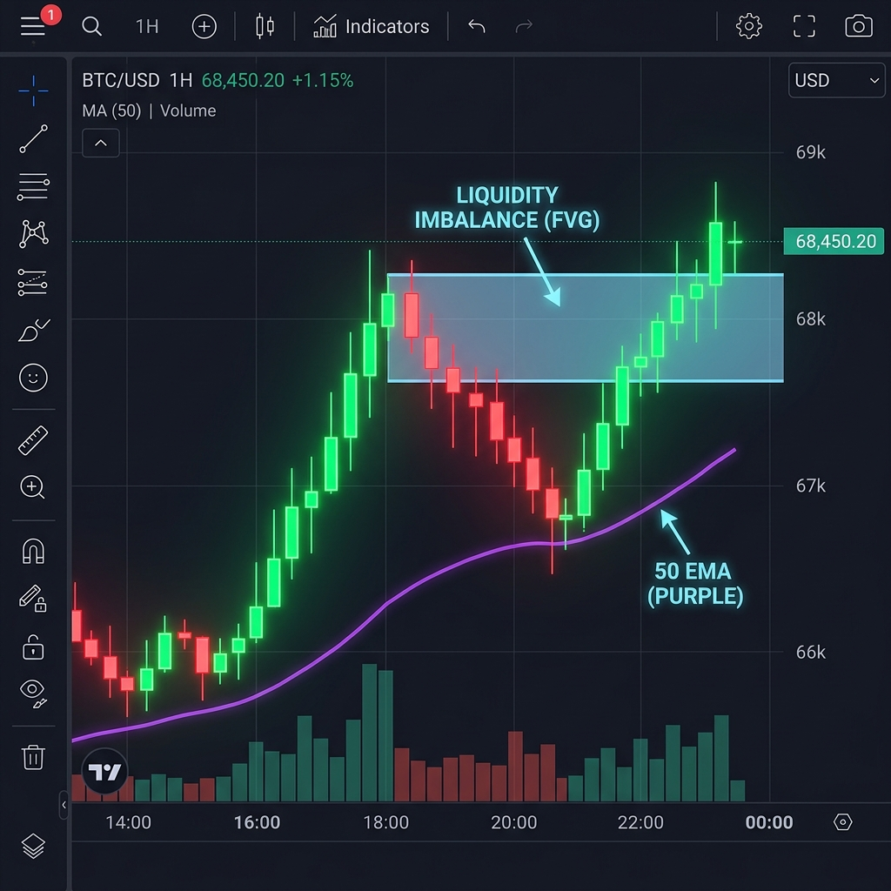

# Example: BTC Long Setup Analysis

> Generated by Hyperbot Explainable Trading Intelligence Framework
> Asset: BTC | Interval: 4H | Risk Profile: Moderate

<p align="center">
  
</p>

---

## Strategy Scoring Matrix

| Strategy | Buy | Sell | Regime | Reason |
|---|---|---|---|---|
| EMA Trend Pullback | *72%* | 15% | uptrend | Price above EMA200, pulled back to EMA20 zone within 0.3 ATR |
| RSI Mean Reversion | 38% | 22% | trending | RSI at 54, no extreme condition detected near EMA50 |
| Bollinger Squeeze | *61%* | 18% | expansion | BB width at 72nd percentile, bullish breakout above upper band |
| Fair Value Gap | *68%* | 12% | fvg_bullish | Fresh bullish FVG at 67,240 - 67,580 (3 bars old, unfilled) |
| MACD Momentum | *65%* | 20% | momentum_up | MACD crossed bullish 2 bars ago, histogram accelerating |

**Consensus: LONG** -- 4/5 strategies agree | Avg Buy: 60.8% | Avg Sell: 17.4%

---

## Trade Rationale

```
Trade Rationale: BTC | 4H | LONG Setup
------------------------------------------------------------
Confidence Score:      61/100  (4/5 strategies agree)
------------------------------------------------------------
Trend Direction:       Uptrend (Price > EMA200, EMA20 > EMA200)
Volatility Regime:     Expanding / Breakout (BB width at 72nd percentile)
Momentum State:        MACD bullish crossover, histogram accelerating
Key Level:             FVG detected (fvg_bullish) -- Fresh bullish FVG at 67,240
------------------------------------------------------------
Entry Price:           67,842.5000
Stop Loss:             66,918.2500
Take Profit:           69,691.0000
Risk / Reward:         1:2.0
------------------------------------------------------------
Position Sizing:       8.4% of portfolio
Sizing Rationale:      Risking 1.0% of account per trade with a 1.36% stop
                       distance (924.25 pts = 1.5 x ATR14)
------------------------------------------------------------
Strategy Breakdown:
  Ema Trend Pullback      Buy:  72%  Sell:  15%  [AGREE]
  Rsi Mean Reversion      Buy:  38%  Sell:  22%  [pass]
  Bollinger Squeeze       Buy:  61%  Sell:  18%  [AGREE]
  Fair Value Gap           Buy:  68%  Sell:  12%  [AGREE]
  Macd Momentum           Buy:  65%  Sell:  20%  [AGREE]
------------------------------------------------------------
Invalidity Conditions (setup is void if any trigger):
  - Close below 66,918.2500 (stop-loss breach)
  - Price closes back below EMA200 (64,215.8000) on daily timeframe
  - RSI drops below 40 without recovery
  - MACD histogram turns negative
  - Bullish FVG fills on a candle close (close-based, not wick)
------------------------------------------------------------
Summary: 4/5 analysis layers aligned on a long setup. The Uptrend
environment with expanding / breakout volatility supports the setup.
Risk is defined at 1.36% of entry with a 1:2.0 reward target.
------------------------------------------------------------
```

---

## Risk Assessment

```
Risk Assessment [MODERATE profile] -- APPROVED
--------------------------------------------------
Adjusted Position Size: 8.4% of portfolio
Rationale: Setup passes moderate risk profile. Adjusted to 8.4%
position size. Daily PnL buffer remaining: -4.00%.
--------------------------------------------------
```

No warnings raised. Position size is within the moderate profile cap of 15%.

---

## Institutional Context

```
Institutional Context:
--------------------------------------------------
Asset:               BTC
Sector:              Digital Assets
Institutional Flow:  Neutral
Signal:              Spot ETF inflows have stabilised. Major custodians
                     report flat allocation changes over the past 30 days.
                     No clear institutional accumulation or distribution
                     signal at this time.
Macro Headwind:      Elevated short-term interest rates reduce
                     speculative risk appetite.
Source:              institutional-finance-skills / digital-asset-flows
Live Feed:           Stub mode -- see institutional-finance-skills
--------------------------------------------------

Institutional Alignment: Institutional flow is neutral -- no directional
conviction from institutional participants.
```

---

## Interpretation

This is a technically clean long setup. Four of five analysis layers agree, driven by a clear uptrend structure (EMA alignment), a fresh bullish Fair Value Gap acting as structural support, expanding volatility confirming breakout momentum, and MACD confirming directional acceleration.

The RSI layer did not agree because RSI is in mid-range territory (54) -- it's not signaling an extreme condition, which is what that layer is designed to catch. This is expected behavior; RSI mean reversion is a contrarian layer and typically doesn't fire during trend-following setups.

The institutional context is neutral, which means there's no macro tailwind or headwind to adjust for. The risk assessment approved the trade under the moderate profile with no position size adjustments needed.

**Key thing to watch:** The bullish FVG at 67,240 is the structural anchor for this setup. If price closes below that gap (not just wicks into it), the setup is invalidated regardless of what the other layers say.
