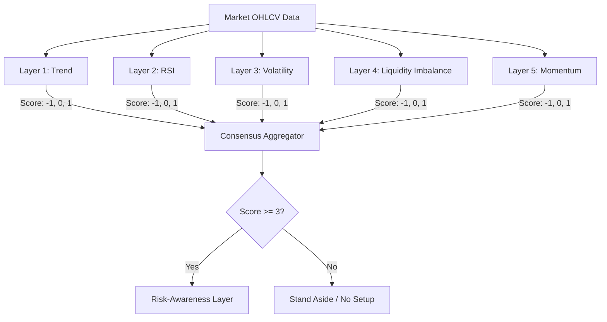

# Explainable AI for Multi-Layer Trading Rationale Generation

> [!NOTE]
> **Abstract:** Modern automated trading systems frequently prioritize predictive accuracy over interpretability, leaving human operators unable to understand the reasoning behind a given signal. This paper outlines the architecture of *Hyperbot*, an explainable trading intelligence framework designed to reverse this paradigm. By employing a multi-layer consensus engine that synthesizes trend direction, mean reversion, volatility regimes, structural liquidity imbalances, and momentum, the system produces human-readable, highly structured trade rationales rather than opaque binary signals.

---

## 1. The "Black Box" Problem in Algorithmic Trading

In financial decision-support systems, trust is a function of transparency. When a machine learning model or algorithmic system suggests a trade but cannot articulate its underlying assumptions, operators are forced to either accept the signal blindly or disregard it entirely. This is the **black box problem**. 

It is particularly acute in dynamic markets where context dictates the viability of a strategy. A simple moving average crossover may be highly profitable in a trending environment but will incur massive drawdown during a volatility squeeze.

The *Explainable Trading Intelligence Framework* proposes a paradigm shift: **from signal generation to rationale generation**. The primary output is a structured, multi-dimensional explanation of the market environment, the explicit constraints of the risk, and defined invalidation conditions.

---

## 2. Methodology: Orthogonal Analysis Layers

To avoid the fragility of single-indicator models (which suffer from high correlation and false positives), the framework evaluates the market through five orthogonal technical layers. Each layer is responsible for measuring a completely different dimension of price action.

### 2.1 Layer 1: Macro Trend & Mean Reversion (EMA)
Measures the dominant directional bias using long-term moving averages, while looking for mean-reverting pullbacks to short-term dynamic support.
- **Mechanic:** Validates trend via the 200-period EMA slope. 
- **Trigger:** Price must retrace to the 20-period EMA, confirming a pullback rather than chasing an over-extended breakout.

### 2.2 Layer 2: Statistical Extremes (RSI)
Identifies statistical anomalies where price has deviated too far from the mean, signaling potential exhaustion.
- **Mechanic:** Relative Strength Index (14).
- **Trigger:** Looks for extreme readings ($RSI < 30$ for bullish setups, $RSI > 70$ for bearish) paired with a structural floor/ceiling.

### 2.3 Layer 3: Volatility Regimes (Bollinger Bands)
Markets alternate between periods of low volatility (compression) and high volatility (expansion). This layer detects the calm before the storm.
- **Mechanic:** Calculates the Bollinger Band Width ($BBW = \frac{Upper - Lower}{Middle}$).
- **Trigger:** Detects a "squeeze" when $BBW$ falls into the lower 20th percentile of a 100-period lookback window, signaling impending directional expansion.

### 2.4 Layer 4: Structural Price Inefficiencies (Liquidity Imbalances)
Traditional indicators lag price. Liquidity imbalances represent physical gaps in the order book where institutional volume pushed price too quickly, leaving a vacuum that price algorithms frequently seek to fill.
- **Mechanic:** Identifies three-candle sequences where the high of Candle 1 and the low of Candle 3 do not overlap (bullish imbalance).
- **Trigger:** Validates when price retraces into the inefficiency zone and prints a strong close.

### 2.5 Layer 5: Directional Velocity (MACD)
Prevents the system from attempting to catch "falling knives" by ensuring underlying momentum supports the structural setup.
- **Mechanic:** Moving Average Convergence Divergence.
- **Trigger:** Requires an active crossover and an accelerating histogram delta.

---

## 3. The Consensus Aggregator Architecture

The outputs of these independent layers are passed to the **Consensus Aggregator**. Rather than relying on a single indicator, the system requires a democratic supermajority.

### 3.1 Aggregation Logic
Each layer $i$ outputs a discrete signal $s_i \in \{-1, 0, 1\}$. 
A setup is only considered structurally valid if the absolute sum of aligned signals meets the strict supermajority threshold:

$$
\sum_{i=1}^{5} s_i \ge 3 \quad (\text{Bullish})
$$

$$
\sum_{i=1}^{5} s_i \le -3 \quad (\text{Bearish})
$$

---

## 4. The Risk-Awareness Module

> [!WARNING]  
> A mathematically valid technical setup is completely useless if executing it violates the operator's survival constraints. 

A critical innovation of Hyperbot is evaluating setups against dynamic risk profiles *before* outputting a rationale.

### 4.1 Dynamic Stop-Loss Calculation
Stop losses are never hardcoded percentages. They are volatility-adjusted using the Average True Range (ATR).
$$
\text{StopLoss}_{\text{long}} = \text{Entry} - (\text{ATR} \times 1.5)
$$

### 4.2 Account Preservation Sizing
Position size is mathematically derived from the maximum tolerable loss, ensuring that wide stops result in smaller positions, normalizing risk across assets.
$$
\text{Size} = \frac{\text{Account Balance} \times \text{Max Risk \%}}{\text{Entry Price} - \text{StopLoss Price}}
$$

If the resulting Risk/Reward ratio is lower than the threshold required by the active Risk Profile (e.g., `< 1:2.0` for a Moderate profile), the system **rejects the trade**, explicitly explaining that the technicals are valid but the risk constraints are broken.

---

## 5. Institutional Context Integration

Retail trading systems suffer from structural blindness to macro flow. To resolve this, Hyperbot bridges with the `institutional-finance-skills` module. 

When a 4H or 1D technical setup is identified, the system queries the institutional overlay. If the technical consensus is bullish (e.g., buying a dip), but institutional footprint analysis shows heavy large-cap distribution (selling), the system flags the divergence as a primary invalidation risk. 

---

## 6. Large Language Model (LLM) Meta-Filtration

The final layer of the architecture is an LLM meta-filter (powered by Claude). The fully structured state matrix (technical scores, risk sizing, and institutional alignment) is serialized into JSON and passed to the LLM.

The LLM is explicitly instructed **not to generate signals**, but to act as a rigorous auditor. It checks for:
1. **Regime Conflicts:** (e.g., A trend-following signal firing during a volatility squeeze).
2. **Contextual Fallacies:** (e.g., A tight stop loss directly inside a liquidity void).

The LLM can only output a boolean `approve` decision alongside its reasoning, acting as the final safety gate.

---

## 7. Conclusion

By prioritizing explainability over opaque predictions, the multi-layer rationale generation approach bridges the gap between algorithmic rigor and human intuition. 

Hyperbot demonstrates that an AI-assisted trading system does not need to be a black box. By structuring output around transparent aggregation, strict risk profiling, and explicit invalidity conditions, it acts not as a blind signal generator, but as a tireless, articulate quantitative research assistant.
